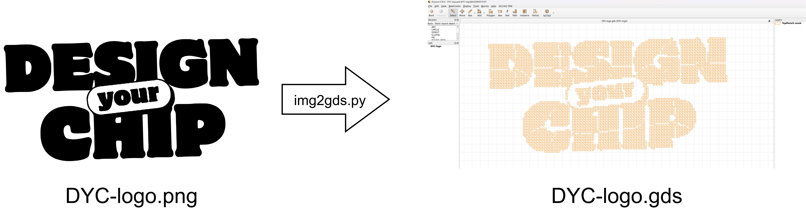
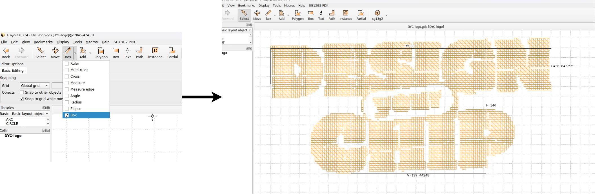
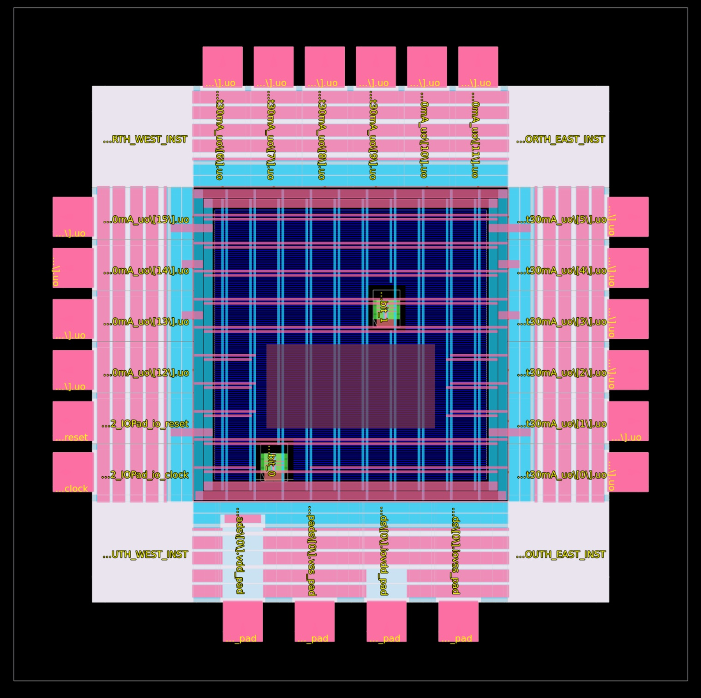

# Top Image integration

Prerequisites — Add numpy to librelane/flake.nix
The img2gds.py script requires numpy, which is not included in the dev shell by default. Apply the provided patch to add it:

```
cd librelane
git apply ../top-image/patches/add-numpy.patch
```

Alternatively, add it manually to the dev shell's extra-python-packages list in flake.nix:

```
# flake.nix — dev shell, extra-python-packages
numpy
```

> Note: include-librelane must be set to true in the dev shell for the full flow to work.

## 1. Enter the Dev Shell

From now on, use nix develop instead of nix-shell. This opens the dev shell with the extra Python packages (including pillow and numpy) needed for the image conversion:

```
cd librelane
nix develop .#dev
```

---

## 2. Convert the Image to GDSII

Use `img2gds.py` to convert any PNG/JPG into a monocromatic GDSII layout on the desired layer (TopMetal2/134 in this case):



To see all available options:

```bash
cd top-image/scripts
python img2gds.py -h
```

The `Makefile` includes a default target for the DYC logo that converts the image and runs DRC checks to verify the layout is manufacturable:

```bash
make img2gds
make drc
```

---

## 3. Measure the Image Layout

Before integrating the image into the chip, measure its dimensions using KLayout:

```bash
make klayout
```



In this example the layout size is **290 × 140 µm**.

---

## 4. Add Blockages in the Chip Layout

Make room for the image in the TopMetal2 layer by adding PDN and routing blockages at the desired location **before** running the LibreLane flow. Add the following to `config.yaml` using the coordinates that match your image size and target placement:

```yaml
PDN_OBSTRUCTIONS:
  - [TopMetal2, 450, 450, 750, 600]

ROUTING_OBSTRUCTIONS:
  - [TopMetal2, 450, 450, 750, 600]
```

Then re-run the LibreLane flow. The blockage creates a clear area in the PDN grid where the image will be inserted:



---

## 5. Insert the Image into the Chip

Use `insert_img.py` to merge the image GDSII into the chip layout:

```bash
python scripts/insert_img.py CHIP_GDS IMG_GDS OUTPUT_GDS X_OFFSET Y_OFFSET CELLNAME
```

The `Makefile` has this pre-configured for the DYC logo:

```bash
make insert-img
make klayout-final
```

